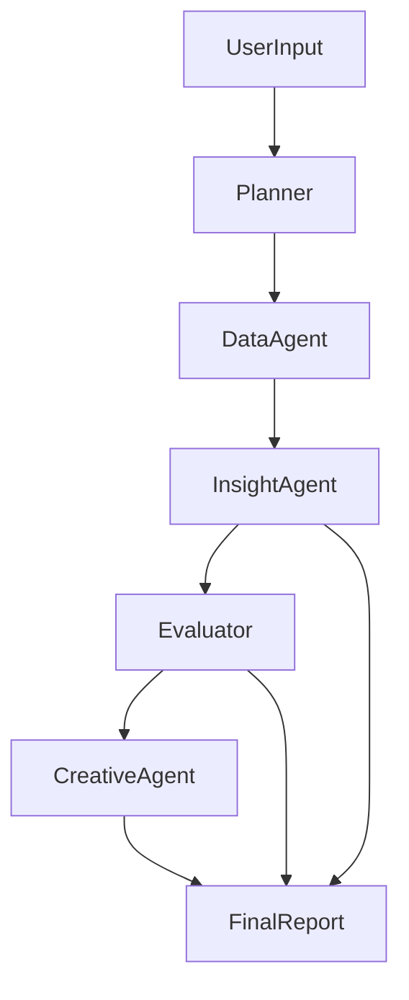

# Agent Architecture & Flow Overview
**Project:** Agentic Facebook Performance Analyst  
**Author:** <your_name_here>

This document describes how each agent in the system interacts, the data exchanged between them, and the responsibilities assigned to each component. The goal is to enable an autonomous pipeline that can analyze Facebook ad performance, uncover drivers behind ROAS fluctuations, and craft improved creative ideas.

---

## 📌 End-to-End Pipeline Diagram



---

# 🧩 Agent-Level Breakdown

Below is a breakdown of each agent, what it consumes, what it produces, and the form of the data exchanged.

---

## 1. **Planner Agent**

### Purpose
Translate a free-form user instruction into an actionable, structured workflow the orchestrator can execute.

### Inputs
- Natural language user request

### Outputs (JSON)
```json
{
  "objective": "string",
  "steps": ["task_1", "task_2"],
  "needs_creatives": true,
  "analysis_window_days": 30
}
```

### Responsibilities
- Detect the user’s primary goal  
- Identify whether creative generation is required  
- Sequence the following agents logically  

---

## 2. **Data Agent**

### Purpose
Extract meaningful statistical signals from the cleaned dataset without overloading the LLM with raw data.

### Inputs
- Pre-cleaned DataFrame  
- Config thresholds (e.g., low CTR threshold)

### Outputs
```json
{
  "overall_metrics": {},
  "roas_trend": [],
  "top_roas_drops": [],
  "low_ctr_campaigns": []
}
```

### Responsibilities
- Summarize ROAS and CTR movements  
- Flag campaigns with substantial performance shifts  
- Provide condensed metrics optimized for LLM reasoning  

---

## 3. **Insight Agent**

### Purpose
Based on the summarized metrics, produce interpretive hypotheses explaining **why** performance changed.

### Inputs
- Aggregated data summary  
- Planner objective  

### Outputs
```json
[
  {
    "campaign": "string",
    "hypothesis_id": "H1",
    "hypothesis": "string",
    "reasoning": "string",
    "metrics_considered": ["ctr", "roas"],
    "time_window": {
      "before_period": "YYYY-MM-DD to YYYY-MM-DD",
      "after_period": "YYYY-MM-DD to YYYY-MM-DD"
    }
  }
]
```

### Responsibilities
- Correlate metric changes  
- Propose explanations tied to measurable signals  
- Output structured hypotheses  

---

## 4. **Evaluator Agent**

### Purpose
Objectively verify each hypothesis using quantitative checks from the full dataset.

### Inputs
- Hypothesis list  
- Numerical and grouped metrics  

### Outputs
```json
[
  {
    "hypothesis_id": "H1",
    "validated": true,
    "confidence": 0.82,
    "evidence": {},
    "notes": "string"
  }
]
```

### Responsibilities
- Compare before/after values  
- Determine whether claims hold up  
- Assign a confidence level  

---

## 5. **Creative Agent**

### Purpose
For campaigns performing poorly in CTR, produce improved creative suggestions grounded in historical messaging and audience attributes.

### Inputs
- Low-CTR campaign list  
- Creative messaging and audience information  

### Output
```json
[
  {
    "campaign": "string",
    "new_creatives": [
      {
        "headline": "string",
        "primary_text": "string",
        "cta": "string",
        "angle": "string"
      }
    ]
  }
]
```

### Responsibilities
- Assess existing creative weaknesses  
- Produce multiple high-quality variations  
- Align messages with audience type  

---

## 6. **Report Generator**

### Purpose
Assemble all outputs (insights, validations, creative ideas) into a final marketer-friendly report.

### Inputs
- Insight Agent output  
- Evaluator output  
- Creative Agent output  

### Output
- `report.md`  
- `insights.json`  
- `creatives.json`  

---

# ✔ Completed: agent_graph.md
